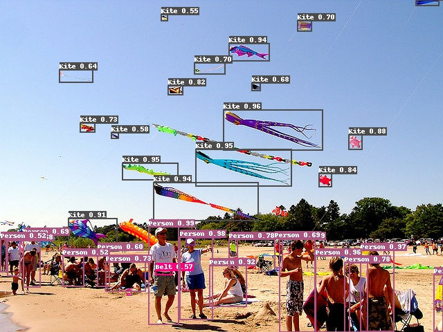


# About me

HI, I am Leheng Li 李乐恒, a third-year undergraduate student from [Dalian University of Technology](http://en.dlut.edu.cn/). I am major in computational mathematics.  
<!-- My adviser is  [Zhixun Su](https://dblp.org/pers/s/Su:Zhixun.html).   -->
I will apply Ph.D program in 2022. I am also looking for reasearch assitant/summer intern position!
### Research Topics
I am interested in Computer Vision and Robot Learning.  
 

# Research Exprience 
 

 &nbsp;&nbsp;&nbsp;&nbsp;&nbsp;&nbsp;&nbsp;&nbsp;&nbsp;&nbsp;&nbsp;&nbsp;&nbsp;&nbsp;[CVPR 2020 herbarium FGVC challenge](https://www.kaggle.com/c/herbarium-2020-fgvc7/overview)  
&nbsp;&nbsp;&nbsp;&nbsp;&nbsp;&nbsp;&nbsp;&nbsp;&nbsp;&nbsp;&nbsp;&nbsp;&nbsp;&nbsp;Large-scale Fine-grained Recognition   
&nbsp;&nbsp;&nbsp;&nbsp;&nbsp;&nbsp;&nbsp;&nbsp;&nbsp;&nbsp;&nbsp;&nbsp;&nbsp;&nbsp;rank:10/153 &nbsp;  [*Tech. detail*](https://www.kaggle.com/c/herbarium-2020-fgvc7/discussion/155000)
 
 
 

 &nbsp;&nbsp;&nbsp;&nbsp;&nbsp;&nbsp;&nbsp;&nbsp;&nbsp;&nbsp;&nbsp;&nbsp;&nbsp;&nbsp;[CVPR 2020 AliProducts Challenge:](https://tianchi.aliyun.com/competition/entrance/231780/introduction)  
&nbsp;&nbsp;&nbsp;&nbsp;&nbsp;&nbsp;&nbsp;&nbsp;&nbsp;&nbsp;&nbsp;&nbsp;&nbsp;&nbsp;Large-scale Product Recognition 
&nbsp;&nbsp;&nbsp;&nbsp;&nbsp;&nbsp;&nbsp;&nbsp;&nbsp;&nbsp;&nbsp;&nbsp;&nbsp;&nbsp;rank:27/688 &nbsp;  [*Tech. detail*](https://www.kaggle.com/c/herbarium-2020-fgvc7/discussion/155000)
 
 
 

  &nbsp;&nbsp;&nbsp;&nbsp;&nbsp;&nbsp;&nbsp;&nbsp;&nbsp;&nbsp;&nbsp;&nbsp;&nbsp;&nbsp;openvino + robomaster auto aim  
&nbsp;&nbsp;&nbsp;&nbsp;&nbsp;&nbsp;&nbsp;&nbsp;&nbsp;&nbsp;&nbsp;&nbsp;&nbsp;&nbsp;[*Tech. detail*](https://github.com/Len-Li/openvino-robomaster)  
&nbsp;&nbsp;&nbsp;&nbsp;&nbsp;&nbsp;&nbsp;&nbsp;&nbsp;&nbsp;&nbsp;&nbsp;&nbsp;&nbsp;[*Slide*](https://github.com/Len-Li/openvino-robomaster)
 
 
 

  &nbsp;&nbsp;&nbsp;&nbsp;&nbsp;&nbsp;&nbsp;&nbsp;&nbsp;&nbsp;&nbsp;&nbsp;&nbsp;&nbsp;Priority Research Application   
&nbsp;&nbsp;&nbsp;&nbsp;&nbsp;&nbsp;&nbsp;&nbsp;&nbsp;&nbsp;&nbsp;&nbsp;&nbsp;&nbsp;[*Tech. detail*](https://len-li.github.io/pra/)
 
 
   
   
   
   
   

  &nbsp;&nbsp;&nbsp;&nbsp;&nbsp;&nbsp;&nbsp;&nbsp;&nbsp;&nbsp;&nbsp;&nbsp;&nbsp;&nbsp;[Deep learning + Precipitation Nowcasting](https://tianchi.aliyun.com/competition/entrance/231729/introduction?spm=5176.12281949.1003.2.493e7bf7jhuz7j&lang=en-us)  
&nbsp;&nbsp;&nbsp;&nbsp;&nbsp;&nbsp;&nbsp;&nbsp;&nbsp;&nbsp;&nbsp;&nbsp;&nbsp;&nbsp;video prediction: ConvLSTM  
&nbsp;&nbsp;&nbsp;&nbsp;&nbsp;&nbsp;&nbsp;&nbsp;&nbsp;&nbsp;&nbsp;&nbsp;&nbsp;&nbsp;[*Tech. detail*](https://len-li.github.io/convlstm/)
 

